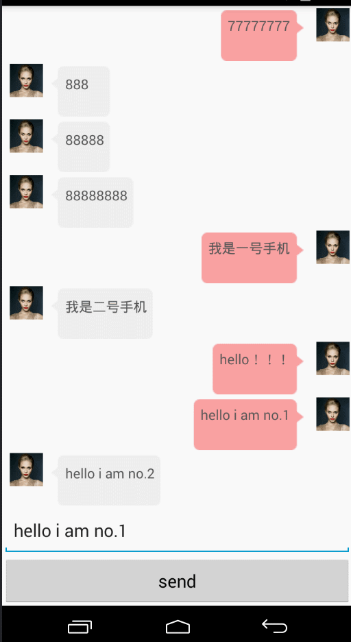

# IM 服务端+客户端

一个使用Tomcat +Okhttp 作为Websocket的服务端和客户端框架，写成的一个聊天项目的雏形。  

## 1.框架的选择
    即时通讯必须是长连接，我们完全可以应用Socket从零开始实现客户端和服务端的逻辑。 
    而此处选择了使用WebSocket协议，WebSocket是http协议为了满足长连接，代替过去Web开发中的轮询、提高性能而出现的协议。 
    服务端使用Tomcat提供的WebSocket框架，客户端使用的Okhttp提供的WebSocket实现。使用成熟的框架，免去了部分底层维护系统健壮性的工作，尤其是服务端可以通过Tomcat强大的功能避免了一次错误请求到这服务崩溃的尴尬。这为我这个主做App开发的来说节省精力用在App的开发上。
## 2.架构设计
 
ClientSocket----------request------------------>ServerSocket  客户端创建socket，并向服务端发起请求 
ClientSocket<-------onOpen ack_code-------------ServerSocket  服务端返回成功码，在客户端onOpen中回调 
ClientSocket-------onMessage connect user_id---->ServerSocket  客户端发起connect消息，传入用户userid，服务端将Session保存到列表中 
ClientSocket<-----onMessage connect_ret usr_id--ServerSocket 服务端发送收到user_id回执 
ClientSOcket-----onMessage msg_XXXXX msg_id----->ServerSocket  客户端发送消息到服务端 
CLientSocket<---onMessage msg_ok_ret msg_id------ServerSocket   服务端发送收到消息回执 
ClientSocket2<--------onMessage msg_XXXXX -------ServerSocket 服务端根据msg_XXX中接收对象，从Session列表接收者取出Session发送数据 

## 3.目前实现功能
到2017年11月9日,目前完成功能有：  
1.客户端和服务端的账号注册逻辑；  
2.客户端和服务端的登录逻辑；  
3.客户端和服务端的私聊功能；  
 聊天页面如图：  
 

